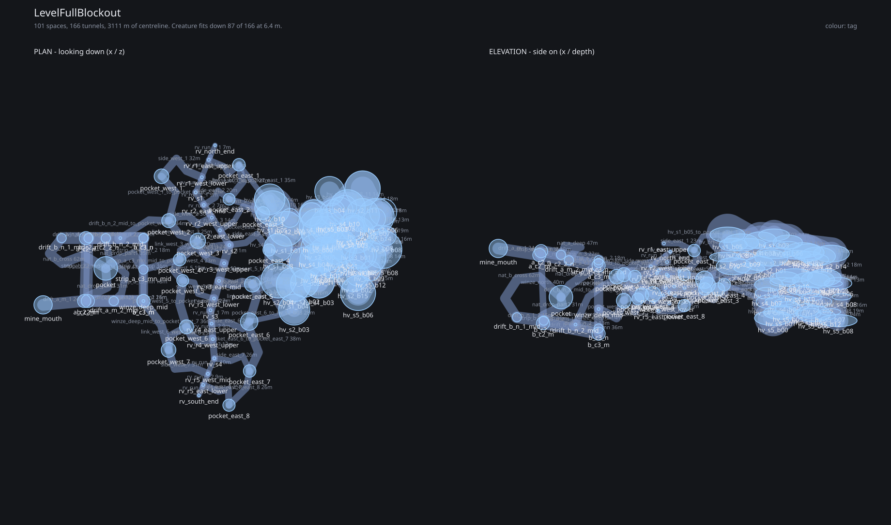

# LevelFullBlockout: annotations

Generated from `res://levels/design/level_full_blockout.tscn` by `tools/level_design/report_annotations.gd`. Every number here is derived from the level; nothing in this file is hand-maintained, so re-run it rather than editing it.

## The model this goes with

`assets/art/environment/level_blockout/sm_level_full_blockout.gltf`, with its `.bin` and `.import` beside it.

- **Units are metres**, one Blender unit to one metre.
- **The model sits at the level's own origin**, so a position in the tables below is the position in the file. Nothing is re-centred.
- **Corners are sharp.** The rock is a resolved CSG carve, which has no fillets. To dull them: Bevel modifier at about 0.15 m with 2 segments and clamp overlap on, then Shade Auto Smooth at 30 degrees, then Weighted Normal.
- **Facing is Godot's -Z forward**, the convention this repo uses throughout, deliberately not the glTF spec's +Z-front.

## What is in it

101 spaces (46 rooms, 53 junctions, 2 dead ends) joined by 166 tunnels, 3111 m of centreline, running from -25 m to -82 m.

87 tunnels are wide enough for the creature at the level's current 6.4 m threshold; the other 79 are refuges.

The graph validates: no duplicate names, no half-wired tunnels, and
every space has a route from the entrance.

## Maps

Plan and elevation, drawn from the same graph, by `tools/level_design/render_level_maps.gd`. Both mine levels sit on one survey grid and the hive is eight strata deep, so in plan a lot of this overprints - pass `--tags=` to draw one part at a time.

## Annotations

### HiveBlockout

**hv_s3_b10** - room, at 78, -48, 2.  
This is probably the single most dangerous room in the entire game. It should be very rewarding.

### MineBlockout

**mine_mouth** - room, at -91, -33, 35.  
Where the player starts. The first stretch east is one straight tunnel with no choices at all, so the map is taught before it is used.

**pocket** - room, at -55, -61, 15.  
Natural cavern off the survey, on the way down. Not a working - nothing here was cut by the machine.

### Connectors

**winze_deep_mid** - junction, at -33, -67, 33.  
Split junction on winze_deep, carrying the mines-to-ravine link at pocket_west_7. No chamber of its own, so the shaft it sits in is unchanged - this is a statement about the graph, not about the shape.

**drift_b_n_2_mid** - junction, at -47, -76, -3.  
Split junction on drift_b_n_2, carrying the lower-level link out to pocket_west_2. No chamber, so the drift is unchanged.

**pocket_east_6_to_hv_s2_b03** - 28 m, 3.0 m wide, from pocket_east_6 to hv_s2_b03.  
Biome link: the ravine to the hive's second stratum. 3.0 m bore.

**pocket_east_3_to_hv_s3_b05** - 29 m, 3.0 m wide, from pocket_east_3 to hv_s3_b05.  
Biome link: the ravine to the hive's third stratum, the deepest of the four eastern crossings. 3.0 m bore.

**hv_s4_b04_to_pocket_east_4** - 27 m, 3.0 m wide, from hv_s4_b04 to pocket_east_4.  
Biome link: the hive's fourth stratum back out to the ravine. 3.0 m bore.

**hv_s1_b05_to_pocket_east_1** - 35 m, 3.0 m wide, from hv_s1_b05 to pocket_east_1.  
Biome link: the ravine to the hive, arriving at the hive's own entrance chamber. 3.0 m bore.

**winze_deep_mid_to_pocket_west_7** - 36 m, 5.0 m wide, from winze_deep_mid to pocket_west_7.  
Biome link: the mines to the ravine, off the deep winze. 5.0 m bore, under the 6.4 m the creature needs.

**strip_a_c3_mn_mid_to_pocket_west_4** - 23 m, 4.0 m wide, from strip_a_c3_mn_mid to pocket_west_4.  
Biome link: the upper mines to the ravine. 4.0 m bore, a refuge.

**drift_b_n_2_mid_to_pocket_west_2** - 44 m, 4.0 m wide, from drift_b_n_2_mid to pocket_west_2.  
Biome link: the lower mines to the ravine, and the longest crossing in the level at 44 m. 4.0 m bore, a refuge.

**pocket_east_5_to_hv_s2_b04** - 20 m, 4.8 m wide, from pocket_east_5 to hv_s2_b04.  
Biome link: the ravine warren to the hive. The widest crossing in the level at 4.8 m, and still a refuge.

## Every space

| Space | Where | Kind | Position x, y, z (m) | Radius | Tags |
|---|---|---|---|---|---|
| `hv_s1_b00` | HiveBlockout | junction | 67, -31, -5 | 6.4 m | `hive` `chamber` |
| `hv_s1_b01` | HiveBlockout | room | 48, -29, -8 | 10.0 m | `hive` `chamber` |
| `hv_s1_b02` | HiveBlockout | room | 59, -28, 11 | 9.1 m | `hive` `chamber` |
| `hv_s1_b03` | HiveBlockout | room | 67, -25, 23 | 8.8 m | `hive` `chamber` |
| `hv_s1_b04` | HiveBlockout | room | 52, -30, 24 | 9.7 m | `hive` `chamber` |
| `hv_s1_b05` | HiveBlockout | room | 40, -25, -20 | 10.0 m | `hive` `chamber` |
| `hv_s1_b06` | HiveBlockout | junction | 74, -31, -16 | 6.4 m | `hive` `chamber` |
| `hv_s1_b08` | HiveBlockout | room | 43, -31, 3 | 8.0 m | `hive` `chamber` |
| `hv_s1_b10` | HiveBlockout | room | 74, -29, 12 | 8.4 m | `hive` `chamber` |
| `hv_s2_b00` | HiveBlockout | room | 67, -35, -5 | 10.4 m | `hive` `chamber` |
| `hv_s2_b01` | HiveBlockout | room | 65, -38, 10 | 9.3 m | `hive` `chamber` |
| `hv_s2_b02` | HiveBlockout | room | 58, -41, 23 | 8.0 m | `hive` `chamber` |
| `hv_s2_b03` | HiveBlockout | room | 53, -44, 38 | 8.9 m | `hive` `chamber` |
| `hv_s2_b04` | HiveBlockout | room | 44, -43, 22 | 10.0 m | `hive` `chamber` |
| `hv_s2_b05` | HiveBlockout | room | 80, -36, 2 | 8.1 m | `hive` `chamber` |
| `hv_s2_b06` | HiveBlockout | junction | 91, -39, 8 | 6.9 m | `hive` `chamber` |
| `hv_s2_b07` | HiveBlockout | junction | 86, -37, -9 | 7.2 m | `hive` `chamber` |
| `hv_s2_b08` | HiveBlockout | room | 83, -34, -20 | 10.1 m | `hive` `chamber` |
| `hv_s2_b09` | HiveBlockout | junction | 50, -37, -14 | 5.4 m | `hive` `chamber` |
| `hv_s2_b10` | HiveBlockout | room | 39, -38, -25 | 8.8 m | `hive` `chamber` |
| `hv_s2_b11` | HiveBlockout | room | 92, -37, -31 | 10.1 m | `hive` `chamber` |
| `hv_s2_b14` | HiveBlockout | room | 99, -36, -15 | 10.3 m | `hive` `chamber` |
| `hv_s2_b15` | HiveBlockout | room | 86, -35, 19 | 9.2 m | `hive` `chamber` |
| `hv_s3_b00` | HiveBlockout | junction | 72, -52, -8 | 7.3 m | `hive` `chamber` |
| `hv_s3_b01` | HiveBlockout | room | 88, -51, -5 | 10.7 m | `hive` `chamber` |
| `hv_s3_b02` | HiveBlockout | room | 92, -51, -16 | 9.6 m | `hive` `chamber` |
| `hv_s3_b03` | HiveBlockout | junction | 79, -52, -18 | 7.6 m | `hive` `chamber` |
| `hv_s3_b04` | HiveBlockout | room | 73, -50, -30 | 8.5 m | `hive` `chamber` |
| `hv_s3_b05` | HiveBlockout | room | 64, -54, -16 | 8.2 m | `hive` `chamber` |
| `hv_s3_b06` | HiveBlockout | junction | 103, -53, -18 | 7.7 m | `hive` `chamber` |
| `hv_s3_b08` | HiveBlockout | junction | 100, -53, -5 | 5.2 m | `hive` `chamber` |
| `hv_s3_b09` | HiveBlockout | room | 95, -49, 8 | 9.6 m | `hive` `chamber` |
| `hv_s3_b10` | HiveBlockout | room | 78, -48, 2 | 10.4 m | `hive` `chamber` |
| `hv_s4_b00` | HiveBlockout | room | 71, -63, -10 | 9.9 m | `hive` `chamber` |
| `hv_s4_b01` | HiveBlockout | junction | 80, -65, 4 | 6.7 m | `hive` `chamber` |
| `hv_s4_b02` | HiveBlockout | junction | 88, -61, 19 | 5.8 m | `hive` `chamber` |
| `hv_s4_b03` | HiveBlockout | junction | 86, -58, -8 | 6.8 m | `hive` `chamber` |
| `hv_s4_b04` | HiveBlockout | junction | 64, -63, 3 | 7.3 m | `hive` `chamber` |
| `hv_s4_b05` | HiveBlockout | junction | 92, -63, 7 | 7.7 m | `hive` `chamber` |
| `hv_s4_b06` | HiveBlockout | junction | 73, -63, 13 | 5.7 m | `hive` `chamber` |
| `hv_s4_b07` | HiveBlockout | junction | 62, -58, -16 | 6.5 m | `hive` `chamber` |
| `hv_s4_b08` | HiveBlockout | junction | 105, -61, -4 | 5.5 m | `hive` `chamber` |
| `hv_s4_b10` | HiveBlockout | junction | 81, -57, -20 | 6.9 m | `hive` `chamber` |
| `hv_s5_b00` | HiveBlockout | room | 66, -73, -9 | 10.6 m | `hive` `chamber` |
| `hv_s5_b01` | HiveBlockout | room | 70, -69, 6 | 9.8 m | `hive` `chamber` |
| `hv_s5_b02` | HiveBlockout | junction | 85, -68, -10 | 7.0 m | `hive` `chamber` |
| `hv_s5_b03` | HiveBlockout | junction | 75, -67, -18 | 7.2 m | `hive` `chamber` |
| `hv_s5_b05` | HiveBlockout | junction | 88, -70, 9 | 6.0 m | `hive` `chamber` |
| `hv_s5_b06` | HiveBlockout | room | 89, -70, 29 | 10.0 m | `hive` `chamber` |
| `hv_s5_b07` | HiveBlockout | junction | 99, -69, -14 | 6.1 m | `hive` `chamber` |
| `hv_s5_b08` | HiveBlockout | room | 103, -74, 4 | 10.8 m | `hive` `chamber` |
| `hv_s5_b12` | HiveBlockout | junction | 96, -71, 16 | 5.6 m | `hive` `chamber` |
| `mine_mouth` | MineBlockout | room | -91, -33, 35 | 5.3 m | `entrance` |
| `a_c2_m` | MineBlockout | junction | -67, -37, 33 | 3.8 m | `mines_a` |
| `pocket` | MineBlockout | room | -55, -61, 15 | 6.8 m | `cavern` |
| `a_c2_n` | MineBlockout | junction | -66, -34, -3 | 3.8 m | `mines_a` |
| `a_c2_2_n` | MineBlockout | junction | -55, -36, -3 | 2.6 m | `mines_a` |
| `a_c3_m` | MineBlockout | junction | -33, -43, 33 | 3.8 m | `mines_a` |
| `a_c3_n` | MineBlockout | junction | -33, -40, -3 | 2.6 m | `mines_a` |
| `b_c2_m` | MineBlockout | junction | -65, -76, 33 | 3.8 m | `mines_b` |
| `b_c2_n` | MineBlockout | junction | -65, -74, -3 | 2.6 m | `mines_b` |
| `b_c3_m` | MineBlockout | junction | -33, -82, 33 | 3.8 m | `mines_b` |
| `b_c3_n` | MineBlockout | junction | -33, -79, -3 | 2.6 m | `mines_b` |
| `strip_a_c3_mn_mid` | MineBlockout | junction | -33, -41, 15 | 2.6 m | `mines_a` |
| `drift_b_n_1_mid` | MineBlockout | junction | -80, -72, -3 | 2.6 m | `mines_b` |
| `drift_a_m_2_mid` | MineBlockout | junction | -50, -40, 33 | 2.6 m | `mines_a` |
| `rv_north_end` | RavineBlockout | dead end | 7, -35, -56 | - | `ravine` `chasm` |
| `rv_s1` | RavineBlockout | junction | -4, -43, -29 | - | `ravine` `chasm` |
| `rv_s2` | RavineBlockout | junction | 16, -56, 1 | - | `ravine` `chasm` |
| `rv_s3` | RavineBlockout | junction | 5, -55, 39 | - | `ravine` `chasm` |
| `rv_s4` | RavineBlockout | junction | 7, -58, 66 | - | `ravine` `chasm` |
| `rv_south_end` | RavineBlockout | dead end | -2, -63, 87 | - | `ravine` `chasm` `entrance` |
| `rv_r1_east_upper` | RavineBlockout | junction | 4, -30, -47 | - | `ravine` `chasm` |
| `pocket_east_1` | RavineBlockout | room | 21, -34, -45 | 3.6 m | `ravine` `pocket` |
| `rv_r1_west_lower` | RavineBlockout | junction | -0, -47, -38 | - | `ravine` `chasm` |
| `pocket_west_1` | RavineBlockout | room | -23, -49, -38 | 4.2 m | `ravine` `pocket` |
| `rv_r2_east_mid` | RavineBlockout | junction | 1, -45, -22 | - | `ravine` `chasm` |
| `pocket_east_2` | RavineBlockout | room | 15, -48, -25 | 3.4 m | `ravine` `pocket` |
| `rv_r2_west_upper` | RavineBlockout | junction | 6, -41, -14 | - | `ravine` `chasm` |
| `pocket_west_2` | RavineBlockout | room | -19, -48, -13 | 4.0 m | `ravine` `pocket` |
| `rv_r2_east_lower` | RavineBlockout | junction | 10, -60, -7 | - | `ravine` `chasm` |
| `pocket_east_3` | RavineBlockout | room | 35, -56, -17 | 3.8 m | `ravine` `pocket` |
| `pocket_west_3` | RavineBlockout | room | -2, -59, -1 | 4.4 m | `ravine` `pocket` |
| `pocket_east_4` | RavineBlockout | room | 38, -54, 4 | 3.5 m | `ravine` `pocket` |
| `rv_r3_west_upper` | RavineBlockout | junction | 13, -46, 12 | - | `ravine` `chasm` |
| `pocket_west_4` | RavineBlockout | room | -13, -49, 10 | 3.6 m | `ravine` `pocket` |
| `rv_r3_east_mid` | RavineBlockout | junction | 10, -55, 22 | - | `ravine` `chasm` |
| `pocket_east_5` | RavineBlockout | room | 29, -54, 24 | 4.5 m | `ravine` `pocket` |
| `rv_r3_west_lower` | RavineBlockout | junction | 7, -64, 32 | - | `ravine` `chasm` |
| `pocket_west_5` | RavineBlockout | room | -11, -62, 21 | 3.4 m | `ravine` `pocket` |
| `rv_r4_east_upper` | RavineBlockout | junction | 5, -48, 46 | - | `ravine` `chasm` |
| `pocket_east_6` | RavineBlockout | room | 27, -51, 45 | 5.0 m | `ravine` `pocket` |
| `rv_r4_west_upper` | RavineBlockout | junction | 6, -48, 55 | - | `ravine` `chasm` |
| `pocket_west_6` | RavineBlockout | room | -9, -59, 48 | 4.0 m | `ravine` `pocket` |
| `pocket_east_7` | RavineBlockout | room | 27, -56, 73 | 3.6 m | `ravine` `pocket` |
| `rv_r5_west_mid` | RavineBlockout | junction | 3, -60, 75 | - | `ravine` `chasm` |
| `pocket_west_7` | RavineBlockout | room | -19, -63, 61 | 4.2 m | `ravine` `pocket` |
| `rv_r5_east_lower` | RavineBlockout | junction | 1, -69, 81 | - | `ravine` `chasm` |
| `pocket_east_8` | RavineBlockout | room | 15, -66, 93 | 3.5 m | `ravine` `pocket` |
| `winze_deep_mid` | Connectors | junction | -33, -67, 33 | - | - |
| `drift_b_n_2_mid` | Connectors | junction | -47, -76, -3 | - | - |

## Every tunnel

| Tunnel | Where | From | To | Length | Width | Height | Tags |
|---|---|---|---|---|---|---|---|
| `hv_s1_bore_00_06` | HiveBlockout | `hv_s1_b00` | `hv_s1_b06` | 14 m | 11.5 m | 2.7 m | `hive` `bore` |
| `hv_s1_bore_00_10` | HiveBlockout | `hv_s1_b00` | `hv_s1_b10` | 19 m | 6.5 m | 3.0 m | `hive` `bore` |
| `hv_s1_bore_10_03` | HiveBlockout | `hv_s1_b10` | `hv_s1_b03` | 14 m | 17.3 m | 4.4 m | `hive` `bore` |
| `hv_s1_bore_03_02` | HiveBlockout | `hv_s1_b03` | `hv_s1_b02` | 14 m | 10.9 m | 4.9 m | `hive` `bore` |
| `hv_s1_bore_02_04` | HiveBlockout | `hv_s1_b02` | `hv_s1_b04` | 14 m | 17.0 m | 4.2 m | `hive` `bore` |
| `hv_s1_bore_02_08` | HiveBlockout | `hv_s1_b02` | `hv_s1_b08` | 18 m | 9.1 m | 5.2 m | `hive` `bore` |
| `hv_s1_bore_08_01` | HiveBlockout | `hv_s1_b08` | `hv_s1_b01` | 12 m | 15.4 m | 3.6 m | `hive` `bore` |
| `hv_s1_bore_01_05` | HiveBlockout | `hv_s1_b01` | `hv_s1_b05` | 15 m | 24.0 m | 4.3 m | `hive` `bore` |
| `hv_s1_bore_03_04` | HiveBlockout | `hv_s1_b03` | `hv_s1_b04` | 15 m | 10.3 m | 2.9 m | `hive` `bore` |
| `hv_s1_bore_02_10` | HiveBlockout | `hv_s1_b02` | `hv_s1_b10` | 16 m | 21.0 m | 5.7 m | `hive` `bore` |
| `hv_s1_bore_00_02` | HiveBlockout | `hv_s1_b00` | `hv_s1_b02` | 18 m | 8.8 m | 3.0 m | `hive` `bore` |
| `hv_s1_bore_00_01` | HiveBlockout | `hv_s1_b00` | `hv_s1_b01` | 21 m | 6.0 m | 3.0 m | `hive` `bore` `refuge` |
| `hv_s2_bore_00_05` | HiveBlockout | `hv_s2_b00` | `hv_s2_b05` | 14 m | 18.5 m | 3.5 m | `hive` `bore` |
| `hv_s2_bore_05_07` | HiveBlockout | `hv_s2_b05` | `hv_s2_b07` | 12 m | 17.6 m | 3.3 m | `hive` `bore` |
| `hv_s2_bore_07_08` | HiveBlockout | `hv_s2_b07` | `hv_s2_b08` | 12 m | 18.0 m | 3.3 m | `hive` `bore` |
| `hv_s2_bore_05_06` | HiveBlockout | `hv_s2_b05` | `hv_s2_b06` | 13 m | 7.1 m | 3.5 m | `hive` `bore` |
| `hv_s2_bore_06_15` | HiveBlockout | `hv_s2_b06` | `hv_s2_b15` | 13 m | 6.5 m | 2.7 m | `hive` `bore` |
| `hv_s2_bore_08_11` | HiveBlockout | `hv_s2_b08` | `hv_s2_b11` | 14 m | 19.9 m | 6.1 m | `hive` `bore` |
| `hv_s2_bore_07_14` | HiveBlockout | `hv_s2_b07` | `hv_s2_b14` | 14 m | 10.5 m | 3.3 m | `hive` `bore` |
| `hv_s2_bore_00_01` | HiveBlockout | `hv_s2_b00` | `hv_s2_b01` | 15 m | 18.9 m | 4.5 m | `hive` `bore` |
| `hv_s2_bore_01_02` | HiveBlockout | `hv_s2_b01` | `hv_s2_b02` | 15 m | 10.0 m | 5.7 m | `hive` `bore` |
| `hv_s2_bore_02_04` | HiveBlockout | `hv_s2_b02` | `hv_s2_b04` | 15 m | 8.5 m | 5.0 m | `hive` `bore` |
| `hv_s2_bore_02_03` | HiveBlockout | `hv_s2_b02` | `hv_s2_b03` | 16 m | 8.5 m | 3.9 m | `hive` `bore` |
| `hv_s2_bore_00_09` | HiveBlockout | `hv_s2_b00` | `hv_s2_b09` | 20 m | 8.6 m | 2.9 m | `hive` `bore` |
| `hv_s2_bore_09_10` | HiveBlockout | `hv_s2_b09` | `hv_s2_b10` | 16 m | 8.2 m | 2.9 m | `hive` `bore` |
| `hv_s2_bore_01_05` | HiveBlockout | `hv_s2_b01` | `hv_s2_b05` | 17 m | 19.3 m | 3.5 m | `hive` `bore` |
| `hv_s2_bore_06_07` | HiveBlockout | `hv_s2_b06` | `hv_s2_b07` | 17 m | 6.6 m | 3.3 m | `hive` `bore` |
| `hv_s2_bore_08_14` | HiveBlockout | `hv_s2_b08` | `hv_s2_b14` | 17 m | 18.6 m | 6.1 m | `hive` `bore` |
| `hv_s2_bore_11_14` | HiveBlockout | `hv_s2_b11` | `hv_s2_b14` | 18 m | 13.6 m | 4.4 m | `hive` `bore` |
| `hv_s2_bore_05_15` | HiveBlockout | `hv_s2_b05` | `hv_s2_b15` | 19 m | 20.6 m | 3.5 m | `hive` `bore` |
| `hv_s2_bore_03_04` | HiveBlockout | `hv_s2_b03` | `hv_s2_b04` | 19 m | 16.5 m | 3.9 m | `hive` `bore` |
| `hv_s3_bore_00_05` | HiveBlockout | `hv_s3_b00` | `hv_s3_b05` | 12 m | 17.8 m | 3.5 m | `hive` `bore` |
| `hv_s3_bore_00_03` | HiveBlockout | `hv_s3_b00` | `hv_s3_b03` | 13 m | 19.0 m | 3.5 m | `hive` `bore` |
| `hv_s3_bore_00_10` | HiveBlockout | `hv_s3_b00` | `hv_s3_b10` | 13 m | 10.2 m | 3.5 m | `hive` `bore` |
| `hv_s3_bore_10_01` | HiveBlockout | `hv_s3_b10` | `hv_s3_b01` | 12 m | 24.0 m | 4.5 m | `hive` `bore` |
| `hv_s3_bore_01_02` | HiveBlockout | `hv_s3_b01` | `hv_s3_b02` | 12 m | 8.7 m | 5.1 m | `hive` `bore` |
| `hv_s3_bore_02_06` | HiveBlockout | `hv_s3_b02` | `hv_s3_b06` | 12 m | 9.4 m | 4.5 m | `hive` `bore` |
| `hv_s3_bore_03_04` | HiveBlockout | `hv_s3_b03` | `hv_s3_b04` | 13 m | 11.2 m | 3.8 m | `hive` `bore` |
| `hv_s3_bore_01_08` | HiveBlockout | `hv_s3_b01` | `hv_s3_b08` | 13 m | 12.7 m | 2.4 m | `hive` `bore` |
| `hv_s3_bore_08_09` | HiveBlockout | `hv_s3_b08` | `hv_s3_b09` | 14 m | 12.4 m | 2.4 m | `hive` `bore` |
| `hv_s3_bore_06_08` | HiveBlockout | `hv_s3_b06` | `hv_s3_b08` | 13 m | 11.8 m | 2.4 m | `hive` `bore` |
| `hv_s3_bore_02_03` | HiveBlockout | `hv_s3_b02` | `hv_s3_b03` | 13 m | 14.2 m | 3.5 m | `hive` `bore` |
| `hv_s3_bore_02_08` | HiveBlockout | `hv_s3_b02` | `hv_s3_b08` | 14 m | 12.2 m | 2.4 m | `hive` `bore` |
| `hv_s3_bore_03_05` | HiveBlockout | `hv_s3_b03` | `hv_s3_b05` | 15 m | 13.0 m | 3.3 m | `hive` `bore` |
| `hv_s3_bore_01_09` | HiveBlockout | `hv_s3_b01` | `hv_s3_b09` | 15 m | 13.9 m | 3.8 m | `hive` `bore` |
| `hv_s4_bore_00_07` | HiveBlockout | `hv_s4_b00` | `hv_s4_b07` | 12 m | 14.3 m | 4.1 m | `hive` `bore` |
| `hv_s4_bore_00_04` | HiveBlockout | `hv_s4_b00` | `hv_s4_b04` | 14 m | 18.6 m | 3.8 m | `hive` `bore` |
| `hv_s4_bore_04_06` | HiveBlockout | `hv_s4_b04` | `hv_s4_b06` | 14 m | 10.2 m | 2.5 m | `hive` `bore` |
| `hv_s4_bore_06_01` | HiveBlockout | `hv_s4_b06` | `hv_s4_b01` | 12 m | 14.4 m | 2.5 m | `hive` `bore` |
| `hv_s4_bore_01_05` | HiveBlockout | `hv_s4_b01` | `hv_s4_b05` | 12 m | 9.3 m | 3.9 m | `hive` `bore` |
| `hv_s4_bore_05_02` | HiveBlockout | `hv_s4_b05` | `hv_s4_b02` | 13 m | 5.9 m | 2.9 m | `hive` `bore` `refuge` |
| `hv_s4_bore_01_03` | HiveBlockout | `hv_s4_b01` | `hv_s4_b03` | 15 m | 10.6 m | 4.4 m | `hive` `bore` |
| `hv_s4_bore_03_10` | HiveBlockout | `hv_s4_b03` | `hv_s4_b10` | 13 m | 16.5 m | 3.6 m | `hive` `bore` |
| `hv_s4_bore_05_08` | HiveBlockout | `hv_s4_b05` | `hv_s4_b08` | 18 m | 10.4 m | 2.5 m | `hive` `bore` |
| `hv_s4_bore_00_03` | HiveBlockout | `hv_s4_b00` | `hv_s4_b03` | 16 m | 16.3 m | 4.0 m | `hive` `bore` |
| `hv_s4_bore_00_10` | HiveBlockout | `hv_s4_b00` | `hv_s4_b10` | 16 m | 13.3 m | 3.6 m | `hive` `bore` |
| `hv_s4_bore_00_01` | HiveBlockout | `hv_s4_b00` | `hv_s4_b01` | 16 m | 9.0 m | 4.5 m | `hive` `bore` |
| `hv_s4_bore_01_04` | HiveBlockout | `hv_s4_b01` | `hv_s4_b04` | 17 m | 11.3 m | 3.6 m | `hive` `bore` |
| `hv_s4_bore_03_05` | HiveBlockout | `hv_s4_b03` | `hv_s4_b05` | 17 m | 16.6 m | 3.9 m | `hive` `bore` |
| `hv_s5_bore_00_03` | HiveBlockout | `hv_s5_b00` | `hv_s5_b03` | 13 m | 17.2 m | 5.4 m | `hive` `bore` |
| `hv_s5_bore_03_02` | HiveBlockout | `hv_s5_b03` | `hv_s5_b02` | 13 m | 13.8 m | 2.9 m | `hive` `bore` |
| `hv_s5_bore_02_07` | HiveBlockout | `hv_s5_b02` | `hv_s5_b07` | 14 m | 12.4 m | 2.6 m | `hive` `bore` |
| `hv_s5_bore_00_01` | HiveBlockout | `hv_s5_b00` | `hv_s5_b01` | 16 m | 20.8 m | 3.9 m | `hive` `bore` |
| `hv_s5_bore_01_05` | HiveBlockout | `hv_s5_b01` | `hv_s5_b05` | 17 m | 7.4 m | 4.0 m | `hive` `bore` |
| `hv_s5_bore_05_12` | HiveBlockout | `hv_s5_b05` | `hv_s5_b12` | 11 m | 5.8 m | 3.4 m | `hive` `bore` `refuge` |
| `hv_s5_bore_12_08` | HiveBlockout | `hv_s5_b12` | `hv_s5_b08` | 14 m | 11.7 m | 3.1 m | `hive` `bore` |
| `hv_s5_bore_12_06` | HiveBlockout | `hv_s5_b12` | `hv_s5_b06` | 15 m | 14.4 m | 3.4 m | `hive` `bore` |
| `hv_s5_bore_05_08` | HiveBlockout | `hv_s5_b05` | `hv_s5_b08` | 17 m | 6.8 m | 2.9 m | `hive` `bore` |
| `hv_s5_bore_07_08` | HiveBlockout | `hv_s5_b07` | `hv_s5_b08` | 19 m | 8.3 m | 2.6 m | `hive` `bore` |
| `hv_s5_bore_02_05` | HiveBlockout | `hv_s5_b02` | `hv_s5_b05` | 20 m | 13.0 m | 4.0 m | `hive` `bore` |
| `hv_s5_bore_00_02` | HiveBlockout | `hv_s5_b00` | `hv_s5_b02` | 21 m | 11.3 m | 5.3 m | `hive` `bore` |
| `hv_s5_bore_05_06` | HiveBlockout | `hv_s5_b05` | `hv_s5_b06` | 20 m | 12.5 m | 3.4 m | `hive` `bore` |
| `hv_breach_1_2_0` | HiveBlockout | `hv_s1_b03` | `hv_s2_b02` | 18 m | 7.0 m | = width | `hive` `breach` |
| `hv_breach_1_2_1` | HiveBlockout | `hv_s1_b04` | `hv_s2_b03` | 20 m | 5.0 m | = width | `hive` `breach` |
| `hv_breach_1_2_2` | HiveBlockout | `hv_s1_b10` | `hv_s2_b15` | 15 m | 3.7 m | = width | `hive` `breach` `merged` |
| `hv_breach_1_2_3` | HiveBlockout | `hv_s1_b04` | `hv_s2_b04` | 16 m | 3.8 m | = width | `hive` `breach` |
| `hv_breach_1_2_4` | HiveBlockout | `hv_s1_b05` | `hv_s2_b10` | 14 m | 5.5 m | = width | `hive` `breach` |
| `hv_breach_2_3_0` | HiveBlockout | `hv_s2_b07` | `hv_s3_b10` | 18 m | 4.7 m | = width | `hive` `breach` |
| `hv_breach_2_3_1` | HiveBlockout | `hv_s2_b01` | `hv_s3_b10` | 18 m | 4.4 m | = width | `hive` `breach` |
| `hv_breach_2_3_2` | HiveBlockout | `hv_s2_b14` | `hv_s3_b06` | 18 m | 6.5 m | = width | `hive` `breach` |
| `hv_breach_2_3_3` | HiveBlockout | `hv_s2_b08` | `hv_s3_b01` | 24 m | 5.7 m | = width | `hive` `breach` |
| `hv_breach_2_3_4` | HiveBlockout | `hv_s2_b08` | `hv_s3_b02` | 19 m | 8.1 m | = width | `hive` `breach` |
| `hv_breach_3_4_0` | HiveBlockout | `hv_s3_b05` | `hv_s4_b07` | 5 m | 7.3 m | = width | `hive` `breach` `merged` |
| `hv_breach_3_4_1` | HiveBlockout | `hv_s3_b10` | `hv_s4_b03` | 16 m | 8.1 m | = width | `hive` `breach` |
| `hv_breach_3_4_2` | HiveBlockout | `hv_s3_b10` | `hv_s4_b04` | 21 m | 5.3 m | = width | `hive` `breach` |
| `hv_breach_3_4_3` | HiveBlockout | `hv_s3_b10` | `hv_s4_b01` | 17 m | 4.8 m | = width | `hive` `breach` |
| `hv_breach_3_4_4` | HiveBlockout | `hv_s3_b02` | `hv_s4_b10` | 13 m | 8.0 m | = width | `hive` `breach` `merged` |
| `hv_breach_4_5_0` | HiveBlockout | `hv_s4_b08` | `hv_s5_b08` | 16 m | 7.3 m | = width | `hive` `breach` |
| `hv_breach_4_5_1` | HiveBlockout | `hv_s4_b02` | `hv_s5_b06` | 14 m | 4.8 m | = width | `hive` `breach` |
| `hv_breach_4_5_2` | HiveBlockout | `hv_s4_b02` | `hv_s5_b12` | 14 m | 7.5 m | = width | `hive` `breach` |
| `hv_breach_4_5_3` | HiveBlockout | `hv_s4_b07` | `hv_s5_b03` | 15 m | 6.4 m | = width | `hive` `breach` |
| `hv_breach_4_5_4` | HiveBlockout | `hv_s4_b05` | `hv_s5_b05` | 8 m | 5.8 m | = width | `hive` `breach` |
| `drift_a_m_1` | MineBlockout | `mine_mouth` | `a_c2_m` | 24 m | 6.8 m | = width | `drift` |
| `drift_a_m_2` | MineBlockout | `a_c2_m` | `drift_a_m_2_mid` | 17 m | 6.8 m | = width | `drift` |
| `drift_a_n_2` | MineBlockout | `a_c2_n` | `a_c2_2_n` | 12 m | 6.8 m | = width | `drift` |
| `drift_a_n_3` | MineBlockout | `a_c2_2_n` | `a_c3_n` | 22 m | 6.8 m | = width | `drift` |
| `strip_a_c2_mn` | MineBlockout | `a_c2_m` | `a_c2_n` | 36 m | 5.3 m | = width | `strip` |
| `strip_a_c3_mn` | MineBlockout | `a_c3_m` | `strip_a_c3_mn_mid` | 18 m | 3.4 m | = width | `strip` `refuge` |
| `drift_b_m_2` | MineBlockout | `b_c2_m` | `b_c3_m` | 32 m | 6.8 m | = width | `drift` |
| `drift_b_n_2` | MineBlockout | `b_c2_n` | `b_c3_n` | 32 m | 6.8 m | = width | `drift` |
| `strip_b_c2_mn` | MineBlockout | `b_c2_m` | `b_c2_n` | 36 m | 5.3 m | = width | `strip` |
| `strip_b_c3_mn` | MineBlockout | `b_c3_m` | `b_c3_n` | 36 m | 5.3 m | = width | `strip` |
| `winze_deep` | MineBlockout | `a_c3_m` | `b_c3_m` | 39 m | 5.3 m | = width | `winze` |
| `winze_north` | MineBlockout | `a_c2_n` | `b_c2_n` | 40 m | 3.8 m | = width | `winze` `refuge` |
| `nat_a_deep` | MineBlockout | `a_c2_2_n` | `drift_a_m_2_mid` | 47 m | 4.1 m | = width | `natural` `refuge` |
| `nat_drop_part1` | MineBlockout | `strip_a_c3_mn_mid` | `pocket` | 35 m | 5.1 m | = width | `natural` |
| `nat_drop_part2` | MineBlockout | `pocket` | `b_c2_m` | 31 m | 5.1 m | = width | `natural` |
| `nat_b_cross` | MineBlockout | `drift_b_n_1_mid` | `pocket` | 62 m | 5.4 m | = width | `natural` |
| `strip_a_c3_mn_2` | MineBlockout | `strip_a_c3_mn_mid` | `a_c3_n` | 18 m | 3.4 m | = width | `strip` `refuge` |
| `drift_b_n_1_2` | MineBlockout | `drift_b_n_1_mid` | `b_c2_n` | 15 m | 6.8 m | = width | `drift` |
| `drift_a_m_2_2` | MineBlockout | `drift_a_m_2_mid` | `a_c3_m` | 17 m | 6.8 m | = width | `drift` |
| `rv_run_1` | RavineBlockout | `rv_north_end` | `rv_s1` | 30 m | 3.0 m | 24.0 m | `ravine` `chasm` |
| `rv_run_2` | RavineBlockout | `rv_s1` | `rv_s2` | 38 m | 4.0 m | 28.0 m | `ravine` `chasm` |
| `rv_run_3` | RavineBlockout | `rv_s2` | `rv_s3` | 39 m | 5.0 m | 32.0 m | `ravine` `chasm` |
| `rv_run_4` | RavineBlockout | `rv_s3` | `rv_s4` | 28 m | 4.0 m | 28.0 m | `ravine` `chasm` |
| `rv_run_5` | RavineBlockout | `rv_s4` | `rv_south_end` | 24 m | 3.0 m | 24.0 m | `ravine` `chasm` |
| `side_east_1` | RavineBlockout | `rv_r1_east_upper` | `pocket_east_1` | 23 m | 3.4 m | = width | `ravine` `winding` `refuge` |
| `side_west_1` | RavineBlockout | `rv_r1_west_lower` | `pocket_west_1` | 32 m | 4.6 m | = width | `ravine` `winding` |
| `side_east_2` | RavineBlockout | `rv_r2_east_mid` | `pocket_east_2` | 20 m | 3.6 m | = width | `ravine` `winding` `refuge` |
| `side_west_2` | RavineBlockout | `rv_r2_west_upper` | `pocket_west_2` | 30 m | 4.4 m | = width | `ravine` `winding` |
| `side_east_3` | RavineBlockout | `rv_r2_east_lower` | `pocket_east_3` | 32 m | 3.2 m | = width | `ravine` `winding` `refuge` |
| `side_west_3` | RavineBlockout | `rv_s2` | `pocket_west_3` | 24 m | 5.0 m | = width | `ravine` `winding` |
| `side_east_4` | RavineBlockout | `rv_s2` | `pocket_east_4` | 29 m | 3.8 m | = width | `ravine` `winding` `refuge` |
| `side_west_4` | RavineBlockout | `rv_r3_west_upper` | `pocket_west_4` | 31 m | 4.2 m | = width | `ravine` `winding` |
| `side_east_5` | RavineBlockout | `rv_r3_east_mid` | `pocket_east_5` | 20 m | 5.2 m | = width | `ravine` `winding` |
| `side_west_5` | RavineBlockout | `rv_r3_west_lower` | `pocket_west_5` | 23 m | 3.3 m | = width | `ravine` `winding` `refuge` |
| `side_east_6` | RavineBlockout | `rv_r4_east_upper` | `pocket_east_6` | 25 m | 4.0 m | = width | `ravine` `winding` |
| `side_west_6` | RavineBlockout | `rv_r4_west_upper` | `pocket_west_6` | 25 m | 4.8 m | = width | `ravine` `winding` |
| `side_east_7` | RavineBlockout | `rv_s4` | `pocket_east_7` | 26 m | 3.5 m | = width | `ravine` `winding` `refuge` |
| `side_west_7` | RavineBlockout | `rv_r5_west_mid` | `pocket_west_7` | 31 m | 4.4 m | = width | `ravine` `winding` |
| `side_east_8` | RavineBlockout | `rv_r5_east_lower` | `pocket_east_8` | 25 m | 3.9 m | = width | `ravine` `winding` `refuge` |
| `link_east_1_east_2` | RavineBlockout | `pocket_east_1` | `pocket_east_2` | 27 m | 4.2 m | = width | `ravine` `warren` |
| `link_east_2_east_3` | RavineBlockout | `pocket_east_2` | `pocket_east_3` | 24 m | 3.6 m | = width | `ravine` `warren` |
| `link_east_5_east_6` | RavineBlockout | `pocket_east_5` | `pocket_east_6` | 27 m | 4.8 m | = width | `ravine` `warren` |
| `link_east_7_east_8` | RavineBlockout | `pocket_east_7` | `pocket_east_8` | 26 m | 3.9 m | = width | `ravine` `warren` |
| `link_west_2_west_3` | RavineBlockout | `pocket_west_2` | `pocket_west_3` | 25 m | 4.5 m | = width | `ravine` `warren` |
| `link_west_3_west_4` | RavineBlockout | `pocket_west_3` | `pocket_west_4` | 20 m | 3.4 m | = width | `ravine` `warren` |
| `link_west_4_west_5` | RavineBlockout | `pocket_west_4` | `pocket_west_5` | 19 m | 5.0 m | = width | `ravine` `warren` |
| `link_west_6_west_7` | RavineBlockout | `pocket_west_6` | `pocket_west_7` | 23 m | 4.1 m | = width | `ravine` `warren` |
| `pocket_east_3_to_pocket_east_4` | RavineBlockout | `pocket_east_3` | `pocket_east_4` | 22 m | 4.0 m | = width | - |
| `pocket_east_5_to_pocket_east_4` | RavineBlockout | `pocket_east_5` | `pocket_east_4` | 27 m | 5.0 m | = width | - |
| `pocket_east_6_to_pocket_east_7` | RavineBlockout | `pocket_east_6` | `pocket_east_7` | 38 m | 5.0 m | = width | - |
| `pocket_west_5_to_pocket_west_6` | RavineBlockout | `pocket_west_5` | `pocket_west_6` | 32 m | 5.0 m | = width | - |
| `pocket_west_1_to_pocket_west_2` | RavineBlockout | `pocket_west_1` | `pocket_west_2` | 32 m | 4.0 m | = width | - |
| `pocket_east_6_to_hv_s2_b03` | Connectors | `pocket_east_6` | `hv_s2_b03` | 28 m | 3.0 m | = width | `biome_link` |
| `pocket_east_3_to_hv_s3_b05` | Connectors | `pocket_east_3` | `hv_s3_b05` | 29 m | 3.0 m | = width | `biome_link` |
| `hv_s4_b04_to_pocket_east_4` | Connectors | `hv_s4_b04` | `pocket_east_4` | 27 m | 3.0 m | = width | `biome_link` |
| `hv_s1_b05_to_pocket_east_1` | Connectors | `hv_s1_b05` | `pocket_east_1` | 35 m | 3.0 m | = width | `biome_link` |
| `winze_deep_mid_to_pocket_west_7` | Connectors | `winze_deep_mid` | `pocket_west_7` | 36 m | 5.0 m | = width | `biome_link` |
| `strip_a_c3_mn_mid_to_pocket_west_4` | Connectors | `strip_a_c3_mn_mid` | `pocket_west_4` | 23 m | 4.0 m | = width | `biome_link` |
| `drift_b_n_2_mid_to_pocket_west_2` | Connectors | `drift_b_n_2_mid` | `pocket_west_2` | 44 m | 4.0 m | = width | `biome_link` |
| `pocket_east_5_to_hv_s2_b04` | Connectors | `pocket_east_5` | `hv_s2_b04` | 20 m | 4.8 m | = width | `ravine` `warren` `biome_link` |

